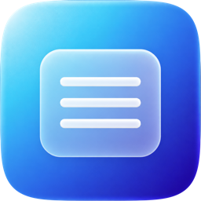

<div align="center">



# Simple Notes

Native macOS text editor. Open, type, save.

[](https://github.com/MoomenALdahdouh/SimpleNotes/actions)
[](LICENSE)
[](https://github.com/MoomenALdahdouh/SimpleNotes/releases/latest)
[](https://github.com/MoomenALdahdouh/SimpleNotes/releases/latest)
[](https://github.com/MoomenALdahdouh/SimpleNotes/releases/latest)

</div>

---

## Overview

Simple Notes is a distraction-free editor for `.txt` and `.md` files, built with Swift, SwiftUI, and AppKit. It opens into a blank `NSTextView` so you can type immediately. Arabic, English, Turkish, mixed RTL/LTR, and other Unicode text use macOS layout. No accounts, ads, telemetry, or network requirement at runtime. A QR code can put the current note on your phone so you can paste it into any notes app.

<p align="center">
  
</p>

## Installation

Download **SimpleNotes.dmg** from [Releases](https://github.com/MoomenALdahdouh/SimpleNotes/releases/latest), drag **Simple Notes** into **Applications**, then open it.

The distributed build is ad-hoc signed (not notarized). If macOS blocks it:

```bash
xattr -d com.apple.quarantine "/Applications/Simple Notes.app"
open "/Applications/Simple Notes.app"
```

Or right-click the app → **Open** → **Open**.

## Build from source

Requires macOS 14+ and Xcode or Command Line Tools.

```bash
git clone https://github.com/MoomenALdahdouh/SimpleNotes.git
cd SimpleNotes

# Checks
./scripts/test.sh

# App + DMG
./scripts/build.sh
./scripts/package-dmg.sh

# Run
open "dist/Simple Notes.app"
```

```bash
# Xcode
open SimpleNotes.xcodeproj
```

## Usage

| Action | Shortcut |
| --- | --- |
| New | ⌘N |
| Open | ⌘O |
| Save | ⌘S |
| Save As | ⇧⌘S |
| Find | ⌘F |
| Show QR Code | toolbar or **File → Show QR Code** |
| Close | ⌘W |

UTF-8 `.txt` is the default. Markdown is edited as source, not previewed.

**Phone:** click the QR toolbar button to open a large scannable code of the current note. Point your camera at it, then copy or share the text into Google Keep, Samsung Notes, or any other notes app. Very long notes may not fit in one code; use **Copy Text** in that window instead.

## Support

[Buy me a coffee](https://ko-fi.com/moomenaldahdouh) · in the app: **Help → Buy Me a Coffee**

## License

[MIT](LICENSE)
